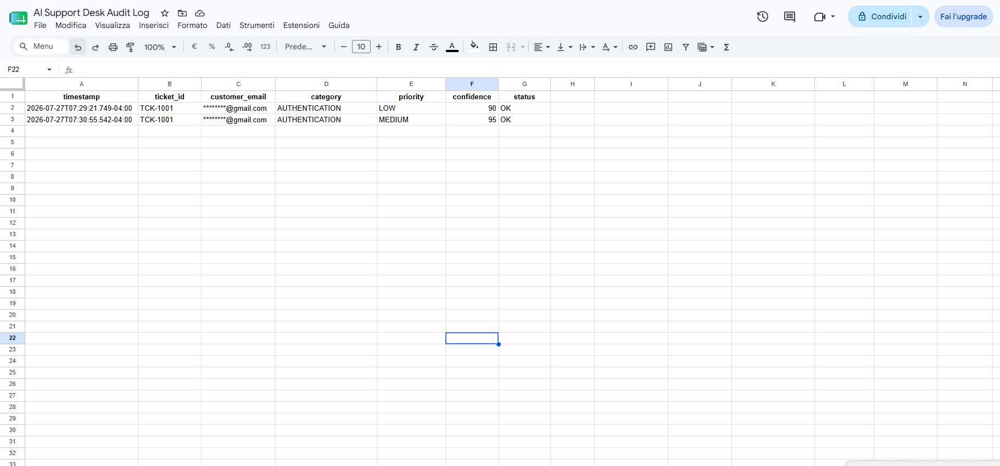
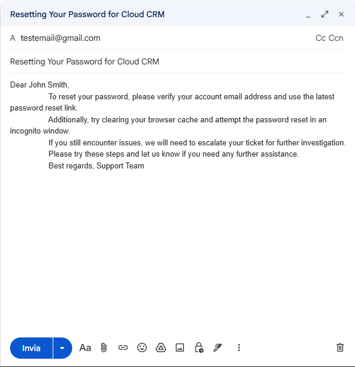

# AI Support Desk Assistant

An AI-powered support ticket automation workflow built with **n8n**, **LLMs**, **Google Sheets**, and **Gmail**.

This project demonstrates how Large Language Models can be combined with deterministic business rules to safely automate customer support workflows while keeping humans in control of high-risk requests.

---
## 🎥 Demo

> **20-second end-to-end demonstration**

> https://github.com/user-attachments/assets/8ed5eac1-e4e1-4db2-8cc9-21d1c6e0eb9d

## Workflow





---

# Key Features

- 🤖 AI-powered ticket classification
- 🎯 Automatic priority and sentiment detection
- 👥 Intelligent support team routing
- 📚 Knowledge Base lookup
- ✉️ AI-generated customer responses
- 📄 Gmail draft creation (never sends emails automatically)
- 🔍 Human review for complex or sensitive requests
- 📊 Audit logging in Google Sheets
- ✅ Deterministic business rules for safe automation

---

# How It Works

The workflow follows these steps:

1. Receive a support ticket through a webhook.
2. Normalize the incoming payload.
3. Analyze the ticket using an LLM.
4. Store the triage decision in an audit log.
5. Apply deterministic business rules.
6. Search the Knowledge Base.
7. If a matching article exists:
   - Generate a response using only approved documentation.
   - Create a Gmail draft.
8. Otherwise:
   - Route the ticket for human review.

---

# Architecture

```text
Webhook
   │
Normalize Ticket
   │
AI Ticket Triage
   │
Audit Log
   │
Business Rules
   │
 ┌───────────────┐
 │               │
Knowledge Base   Human Review
 │
AI Response
 │
Gmail Draft
```

---

# AI + Deterministic Logic

One of the main goals of this project is to demonstrate a safe approach to AI automation.

The LLM is responsible for understanding the ticket:

- Classification
- Priority
- Sentiment
- Knowledge Base selection

The workflow itself makes the final decision.

Automatic responses are only generated when:

- AI status is **OK**
- Confidence score is **80 or higher**
- A matching Knowledge Base article exists

This design minimizes hallucinations and ensures that sensitive or ambiguous requests are always reviewed by a human.

---

# Technologies

- n8n
- OpenAI-compatible LLM
- Google Sheets
- Gmail
- REST Webhooks
- JSON

---

# Example Request

```json
{
  "ticket_id": "12345",
  "customer_name": "John Doe",
  "customer_email": "john@example.com",
  "subject": "Password reset",
  "message": "I can't log into my account.",
  "product": "Pro",
  "plan": "Premium"
}
```

---

# Example Result

```text
Category:
AUTHENTICATION

Priority:
LOW

Knowledge Base:
PASSWORD_RESET

Decision:
AUTO RESPONSE

Output:
Gmail Draft Created
```

---

# Project Structure

```text
.
├── workflow/
│   └── ai-support-desk-assistant.json
│
├── screenshots/
│   ├── workflow.png
│   ├── gmail-draft.png
│   ├── audit-log.png
│   └── knowledge-base.png
│
├── examples/
│
├── README.md
└── LICENSE
```

---

# Setup

To run this workflow you will need:

- OpenAI credentials
- Gmail credentials
- Google Sheets credentials

You'll also need two Google Sheets:

- Knowledge Base
- Audit Log

After importing the workflow into n8n, simply connect your own credentials and configure the Google Sheets nodes.

---

# Future Improvements

- RAG-based Knowledge Base
- CRM integration
- Slack / Microsoft Teams notifications
- Automatic ticket creation
- Multi-language support
- Vector database integration

---

# License

This project is released under the MIT License.
