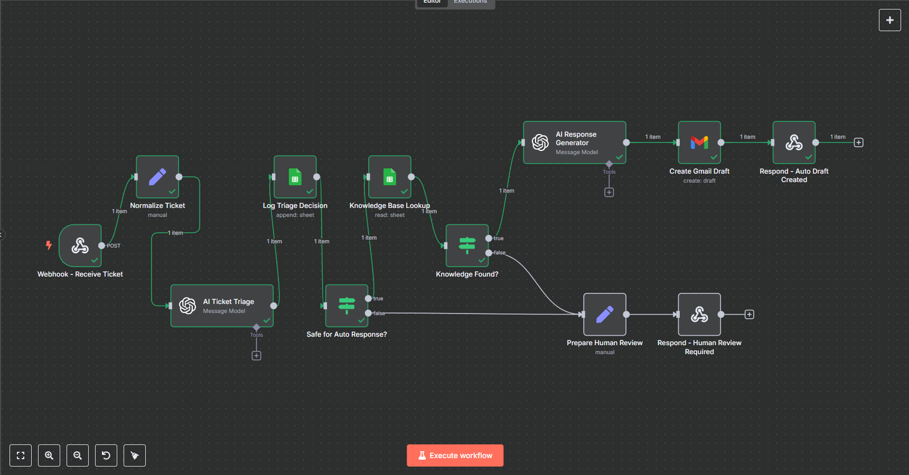
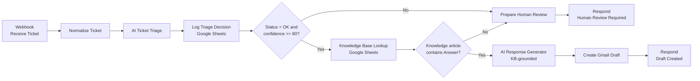

# AI Support Desk Assistant

AI Support Desk Assistant is an n8n workflow for triaging SaaS support tickets and preparing Gmail drafts for review.

It classifies each request, records the decision in Google Sheets, and looks for an approved Knowledge Base article. A Gmail draft is created only when the status, confidence, and knowledge checks pass. All other requests return a human-review response.

> This is a portfolio project, not a production support platform. The repository documents what the current workflow does, what it does not do, and how to test it.

## Demo

**20-second end-to-end demonstration**

https://github.com/user-attachments/assets/8ed5eac1-e4e1-4db2-8cc9-21d1c6e0eb9d



The repository also includes the original [demo video](media/demo.mp4), a [manual validation checklist](docs/VALIDATION.md), and a [project case study](docs/CASE_STUDY.md). Version history is available in the [changelog](CHANGELOG.md).

## Problem

Support teams repeatedly spend time reading incoming requests, identifying urgency, finding internal documentation, and preparing routine replies. Automating the entire process is risky: language-model output can be uncertain, customer messages can be ambiguous, and account-specific actions still require human judgment.

## Solution

AI Support Desk Assistant separates probabilistic analysis from workflow control:

- an LLM classifies and summarizes the ticket;
- Google Sheets records the triage result;
- n8n applies explicit confidence and status checks;
- an active Knowledge Base article must be found before response generation;
- the LLM may draft a response only from that article;
- Gmail saves the result as a draft instead of sending it;
- tickets that do not pass the current checks return a structured human-review response.

The workflow never sends customer email automatically.

## Architecture

This diagram represents the current exported workflow, not an idealized future design.



## Workflow overview

1. A `POST` webhook receives the support ticket.
2. The ticket body is normalized into a fixed internal shape.
3. The triage model returns JSON containing classification, priority, sentiment, team suggestion, knowledge key, recommendations, confidence, and summary.
4. The triage result is appended to a Google Sheets audit log.
5. n8n checks that the model status is `OK` and confidence is at least `80`.
6. Tickets that fail this gate return a human-review response.
7. Tickets that pass are matched against an active Knowledge Base row.
8. A matching article is supplied to the response model; no match returns the human-review response.
9. The generated response is saved as a Gmail draft and its ID is returned to the webhook caller.

## Node breakdown

| Node | Input | Output | Functional purpose | Critical |
|---|---|---|---|---|
| Webhook - Receive Ticket | HTTP `POST` body | Webhook payload | Accepts a new support ticket | Yes |
| Normalize Ticket | Webhook body | Seven normalized ticket fields | Gives downstream nodes a consistent data shape | Yes |
| AI Ticket Triage | Normalized ticket | Structured triage JSON | Classifies and summarizes the request | Yes |
| Log Triage Decision | Triage JSON | Appended sheet row | Records the triage decision for inspection | Yes |
| Safe for Auto Response? | Model status and confidence | True/false route | Applies the first deterministic gate | Yes |
| Knowledge Base Lookup | Model-selected knowledge key | Matching active rows or an empty item | Retrieves approved support instructions | Yes |
| Knowledge Found? | Knowledge Base result | True/false route | Verifies that an `Answer` is available | Yes |
| AI Response Generator | Ticket and one article | JSON subject and email body | Drafts a response using the article as source | Yes |
| Create Gmail Draft | Subject, body, recipient | Gmail draft and draft ID | Saves the response without sending it | Yes |
| Respond - Auto Draft Created | Draft metadata | Webhook JSON response | Confirms draft creation to the caller | No |
| Prepare Human Review | Ticket and triage output | Structured review payload | Prepares the fallback response | Yes |
| Respond - Human Review Required | Review payload | Webhook JSON response | Tells the caller that human review is required | No |

## Decision logic

The LLM performs interpretation. n8n performs routing.

The current automatic-draft path requires all of the following:

1. triage `status` equals `OK`;
2. triage `confidence` is `80` or higher;
3. the Knowledge Base lookup returns an active row with a non-empty `Answer`.

The fields `automatic_resolution_recommended` and `human_review_recommended` are generated and logged, but the current gate does not use them. Category, priority, and sentiment are also not gate conditions. This is documented as a current limitation rather than presented as implemented safety logic.

## Implemented behavior

- LLM classification, priority estimation, sentiment analysis, and team suggestion
- JSON-mode triage and response generation
- Google Sheets audit logging
- Knowledge Base lookup by key and active status
- Response generation constrained to an approved article
- Deterministic status, confidence, and knowledge-presence checks
- Gmail draft creation without automatic sending
- Separate webhook outcomes for draft creation and human review

## Engineering decisions

| Decision | Reason | Trade-off |
|---|---|---|
| n8n instead of a custom service | Makes integrations and routing visible and fast to iterate | Testing and version control are less natural than in a code-first service |
| LLM interpretation plus deterministic routing | Keeps probabilistic output separate from workflow decisions | The quality gate is only as complete as its explicit conditions |
| Gmail drafts instead of direct sending | Preserves human control before customer communication | A person must review and send the draft |
| Google Sheets for audit and knowledge storage | Simple to inspect, edit, and demonstrate | Not suitable for high-volume or strongly transactional workloads |
| Structured human-review webhook response | Gives the calling system an explicit fallback outcome | It does not create a ticket or notify an agent by itself |

## Current limitations

- The safety gate checks only model status and confidence before the Knowledge Base lookup.
- AI recommendations for human review are logged but not enforced by the gate.
- The human-review branch returns JSON but does not persist or assign a ticket.
- Incoming fields are normalized but not validated.
- The webhook is unauthenticated.
- Duplicate active Knowledge Base rows may produce multiple downstream items and drafts.
- There is no retry strategy, dead-letter path, or dedicated error workflow.
- There is no rate-limit handling or production monitoring.
- Conversation history is not stored.
- JSON mode is enabled, but the output is not validated against a separate JSON Schema.

## Error handling

The current implementation favors transparent failure over undocumented recovery behavior.

| Scenario | Current behavior |
|---|---|
| No active Knowledge Base match | Routes to the human-review response |
| Empty Knowledge Base `Answer` | Routes to the human-review response |
| Missing ticket fields | No explicit validation; downstream behavior depends on the missing field |
| Invalid or unavailable AI response | The workflow execution fails at the AI node |
| Google Sheets OAuth/API failure | Execution stops before the next node |
| Gmail OAuth/API failure | Draft creation fails and the webhook success response is not produced |
| Provider timeout or rate limit | No automatic retry is configured |
| Duplicate Knowledge Base matches | Multiple items may continue through response generation |

Planned resilience work belongs in the roadmap and GitHub issues; it is not claimed as part of the current implementation.

## Security considerations

- Public workflow exports contain no credentials or pinned execution data.
- Google document identifiers and n8n workflow-instance identifiers are removed from the public export.
- Gmail creates drafts only; it does not send messages.
- Support tickets may contain personal or confidential data before being sent to the configured AI provider and Google Sheets.
- Production use would require webhook authentication, input validation, rate limiting, data-retention rules, and least-privilege OAuth scopes.
- Operators should sanitize logs and test data before sharing screenshots or execution exports.
- Customer and Knowledge Base text should be treated as untrusted input; draft review remains an important control.

## Non-goals

This workflow is not intended to operate as a complete production support platform.

The current implementation intentionally does not:

- send customer emails automatically;
- replace human support agents;
- perform account-specific actions or make policy decisions;
- persist complete customer conversations;
- provide a ticket-management interface.

## Installation

### Requirements

- An n8n instance with the Google Sheets, Gmail, Webhook, and OpenAI-compatible message-model nodes
- An AI provider credential supported by the n8n message-model node
- Google Sheets OAuth credentials
- Gmail OAuth credentials
- One Knowledge Base sheet
- One triage audit sheet

The exported model ID is `llama-3.3-70b-versatile`. Configure a compatible provider or select another available model after import.

### Import the workflow

1. Clone or download this repository.
2. Open n8n.
3. Select **Import from File**.
4. Import [`workflow/AI Support Desk Assistant.json`](workflow/AI%20Support%20Desk%20Assistant.json).
5. Configure credentials for both AI nodes, both Google Sheets nodes, and the Gmail node.
6. Select your own Google documents and sheets.
7. Confirm the webhook path and test URL.
8. Run the validation scenarios before activating the production webhook.

The public export is intentionally inactive and contains no credential references or Google document IDs.

## Configuration

### Incoming ticket

The webhook expects a JSON body with these fields:

| Field | Purpose |
|---|---|
| `ticket_id` | External ticket identifier |
| `customer_name` | Name used in support context |
| `customer_email` | Recipient used for the Gmail draft |
| `subject` | Ticket subject |
| `message` | Customer request |
| `product` | Product context |
| `plan` | Subscription-plan context |

Example:

```json
{
  "ticket_id": "TCK-1001",
  "customer_name": "Jamie Example",
  "customer_email": "customer@example.com",
  "subject": "Password reset",
  "message": "I cannot sign in and need help resetting my password.",
  "product": "Cloud CRM",
  "plan": "Premium"
}
```

### Knowledge Base sheet

The lookup expects these columns:

| Column | Purpose |
|---|---|
| `Knowledge_Key` | Exact key selected during triage |
| `Active` | Must match `true` |
| `Title` | Article title supplied to response generation |
| `Answer` | Approved instructions supplied to response generation |

Keep each active `Knowledge_Key` unique to avoid generating multiple drafts.

### Audit sheet

The logging node expects these columns:

```text
timestamp
ticket_id
customer_email
subject
category
priority
sentiment
confidence
automatic_resolution
human_escalation
suggested_team
summary
escalation_reason
```

## Validation

See [docs/VALIDATION.md](docs/VALIDATION.md) for the manual validation checklist and expected outcomes.

Example payloads and webhook responses are available in [`examples/`](examples/).

## Roadmap

- Add authenticated webhook ingestion and input-schema validation
- Add retry, error-workflow, and dead-letter handling
- Persist human-review requests in a real ticket queue
- Enforce risk recommendations and category-specific safety rules
- Add automated validation for representative routing scenarios
- Add structured operational logging and monitoring

## Repository structure

```text
.
├── docs/
│   ├── CASE_STUDY.md
│   └── VALIDATION.md
├── examples/
│   ├── knowledge-base-example.csv
│   ├── sample-auto-draft-response.json
│   ├── sample-human-review-response.json
│   └── sample-ticket.json
├── media/
│   └── demo.mp4
├── screenshots/
│   ├── audit.png
│   ├── draft.png
│   └── workflow.png
├── workflow/
│   └── AI Support Desk Assistant.json
├── .gitattributes
├── .gitignore
├── CHANGELOG.md
├── LICENSE
└── README.md
```

## License

Released under the [MIT License](LICENSE).
